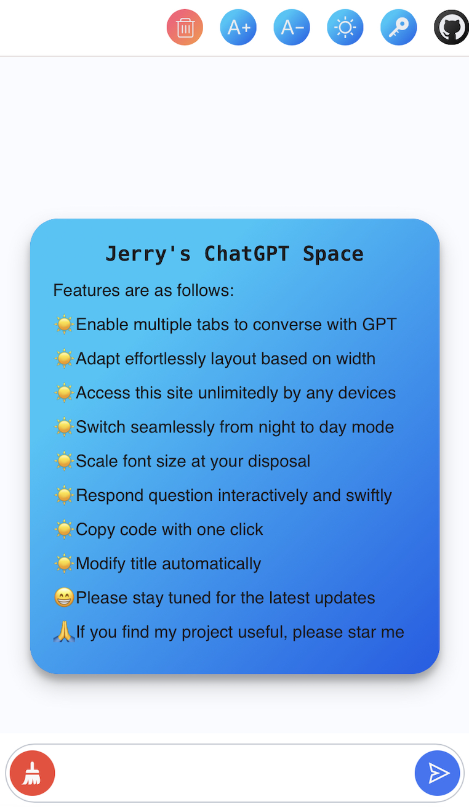

# ChatGPTWeb

### Brief Intro
An online chatroom for ChatGPT api using React
 
### Intention
- Initially, I was inspired by one of my colleagues who compassionately shared his approach to invoke OpenAI api
- Then, I perceived that I was able to build a web app to interact with GPT for individual use.
- Before that, people living in restrictive network regions are easily constrained by openAI official requirements when conversing with chatGPT due to malicious usage or a surge of user access.
- Therefore, I made an attempt to construct this project to assist people who are in need of a chatbot to talk to.

### Quick Glance
- Have a quick look to this project, please visit this link
- https://jerry-chat-gpt.netlify.app/

### Jerry's ChatGPT Features
Features are as follows:
- ☀️Enable multiple tabs to converse with GPT
- ☀️Adapt effortlessly layout based on width
- ☀️Access this site unlimitedly by any devices
- ☀️Switch seamlessly from night to day mode
- ☀️Scale font size at your disposal
- ☀️Respond question interactively and swiftly
- ☀️Copy code with one click
- ☀️Utilize hot key(↑, ↓) to browser history
- 😁Please stay tuned for the latest updates
- 🙏If you find my project useful, please star me

### project images

